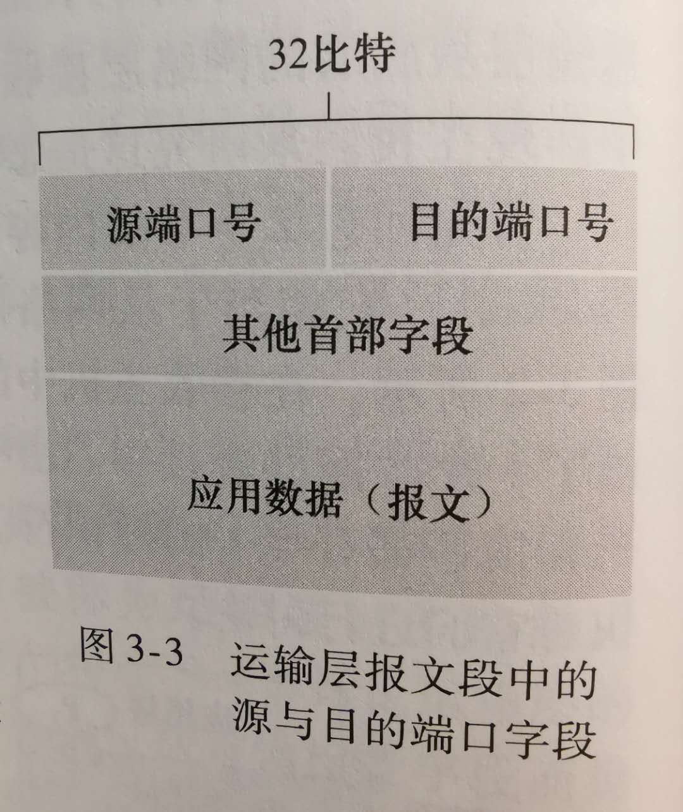

# 计算机网络

## 带宽的单位是 bps（bit/s），流量的单位是 Bps（Byte/s）

## TCP/IP 五层模型

- 应用层 —— 报文：HTTP、DNS、FTP、SMTP、SSH
- 运输层 —— 报文段（segment）：TCP、UDP
- 网络层 —— 数据报（data-gram）：IP、ICMP
- 数据链路层 —— 数据帧：Ethernet、802.11
- 物理层：

## IP

IP 即**网际协议**，它为主机之间提供了逻辑通信。
IP 的服务模型是**尽力而为交付服务**（best-effort delivery service）。
这意味着 IP 尽它“最大的努力”在通信的主机之间交付报文段，但它并不做任何确保。
特别是，它不确保报文段的交付，不保证报文段的按序交付，不保证报文段中数据的完整性。
由于这些原因，IP 被称为**不可靠服务（unreliable service）**。

## UDP 和 TCP

UDP 和 TCP 最基本的责任是，将两个端系统间 IP 的交付服务扩展为运行在端系统上的两个进程之间的交付服务。
将主机间交付扩展到进程间交付被称为**运输层的多路复用**（transport-layer multiplexing）与**多路分解**（demultiplexing）。

UDP 和 TCP 还可以通过在其报文段首部中包括差错检查字段而提供完整性检查。
进程到进程的数据交付和差错检查是两种最低限度的运输层服务，也是 UDP 所能提供的仅有的两种服务。
特别是，与 IP 一样，UDP 也是一种不可靠的服务，即不能保证一个进程所发送的数据能够完整无缺地（或全部！）到达目的进程。

另一方面，TCP 为应用程序提供了几种附加服务：

- **可靠数据传输**（reliable data transfer）
- **拥塞控制**（congestion control）

## 多路复用与多路分解

一个进程（作为网络应用的一部分）有一个或多个**套接字**（socket），它相当于从网络向进程传递数据和从进程向网络传递数据的门户。

将运输层报文段中的数据交付到正确的套接字的工作称为**多路分解**（demultiplexing）。
在源主机从不同套接字中收集数据块，并为每个数据块封装上首部信息（这将在以后用于分解）从而生成报文段，然后将报文段传递到网络层，所有这些工作称为**多路复用**（multiplexing）。

运输层多路复用要求：

1. 套接字有唯一标识符；
2. 每个报文段有特殊字段来指示该报文段所要交付到的套接字。

如下图所示：

这些特殊字段是**源端口号字段**（source port number field）和**目的端口号字段**（destination port number field）。

一个 UDP 套接字是由一个二元组全面标识的，该二元组包含一个目的 IP 地址和一个目的端口号。

TCP 套接字和 UDP 套接字之间的一个细微差别是，TCP 套接字是由一个四元组（源 IP 地址，源端口号、目的 IP 地址、目的端口号）来标识的。

事实上，当今的高性能 Web 服务器通常只使用一个进程，但是为每个新的客户连接创建一个具有新连接套接字的新线程。

运输层最低限度必须提供一种复用/分解服务，以便在网络层与正确的应用级进程之间传递数据。
