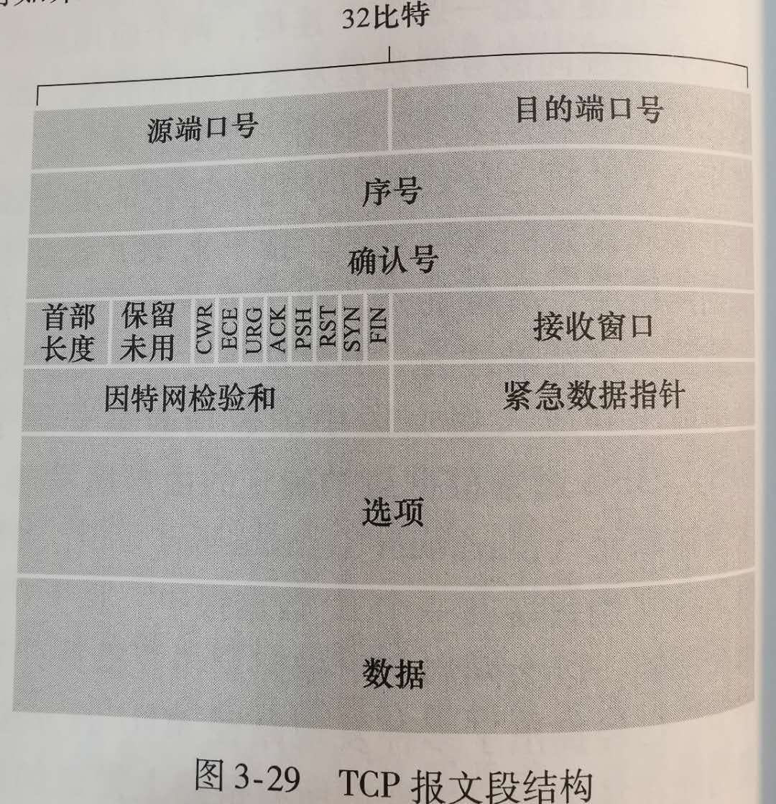

# TCP

TCP 即**传输控制协议**，它为调用它的应用程序提供了一种可靠的、**面向连接**（connection-oriented）的服务。

TCP 连接提供的是**全双工服务**（full-duplex service），TCP 连接也总是**点对点**（point-to-point）的。

## 可靠数据传输（reliable data transfer）

在计算机网络环境中，基于**肯定确认**（positive acknowledgment，**ACK**）（“OK”）与**否定确认**（negative acknowledgment，**NAK**）（“请重复一遍”）这样的重传机制的可靠数据传输协议称为**自动重传请求（Automatic Repeat reQuest，ARQ）协议**。

ARQ 协议中还需要另外三种协议功能来处理存在比特差错的情况：

- 差错检测
- 接收方反馈
- 重传

当发送方处于等待 ACK 或 NAK 的状态时，它不能从上层获得更多的数据，
因此，发送方将不会发送一块新数据，除非发送方确信接收方已正确接收当前分组。
这样的协议被称为**停等**（stop-and-wait）协议。

## 拥塞控制

## TCP 报文段结构

